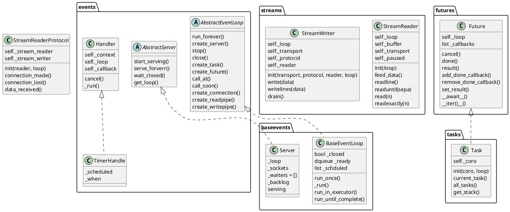

```puml
@startuml
abstract events.AbstractEventLoop{
    run_forever()
    create_server()
    stop()
    close()
    create_task()
    create_future()
    call_at()
    call_soon()
    create_connection()
    create_readpipe()
    create_writepipe()
}

class baseevents.BaseEventLoop{
    bool _closed
    dqueue _ready
    list _schduled

    run_once()
    _run()
    run_in_executor()
    run_until_complete()
}

abstract events.AbstractServer{
    start_serving()
    serve_forverr()
    wait_closed()
    get_loop()
}

class baseevents.Server{
    _loop
    _sockets
    _waiters = []
    _backlog
    serving
}

class events.Handler{
    self._context
    self._loop
    self._callback

    cancel()
    _run()
}

class events.TimerHandle{
    _scheduled
    _when
}

class StreamReaderProtocol{
    self._stream_reader
    self._stream_writer

    init(reader, loop)
    connection_made()
    connection_lost()
    data_received()
}

class streams.StreamReader{
    self._loop
    self._buffer
    self._transport
    self._paused

    init(loop)
    feed_data()
    readline()
    readuntil(sepa)
    read(n)
    readexactly(n)
}

class streams.StreamWriter{
    self._loop
    self._transport
    self._protocol
    self._reader

    init(transport, protocol, reader, loop)
    write(data)
    writelines(data)
    drain()
}

class futures.Future{
    self._loop
    list _callbacks

    cancel()
    done()
    result()
    add_done_callback()
    remove_done_callback()
    set_result()
    __await__()
    __iter()__()
}

class tasks.Task{
    self._coro

    init(coro, loop)
    current_task()
    all_tasks()
    get_stack()

}
AbstractEventLoop <|..BaseEventLoop
AbstractServer <|..Server
Handler <|..TimerHandle
Future <|..Task
@enduml
```