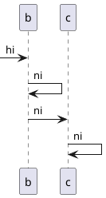
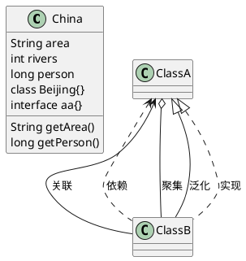

```puml
@startuml
->b:hi
b->b:ni
b->c:ni
c->c:ni

@enduml
```

```puml
@startuml


Class China {
    String area
    int rivers
    long person
    class Beijing{}
    interface aa{}

    String getArea()
    long getPerson()
}


ClassA <-- ClassB:关联
ClassA <.. ClassB : 依赖
ClassA o-- ClassB:聚集
ClassA <|-- ClassB:泛化
ClassA <|.. ClassB:实现
@enduml
```

